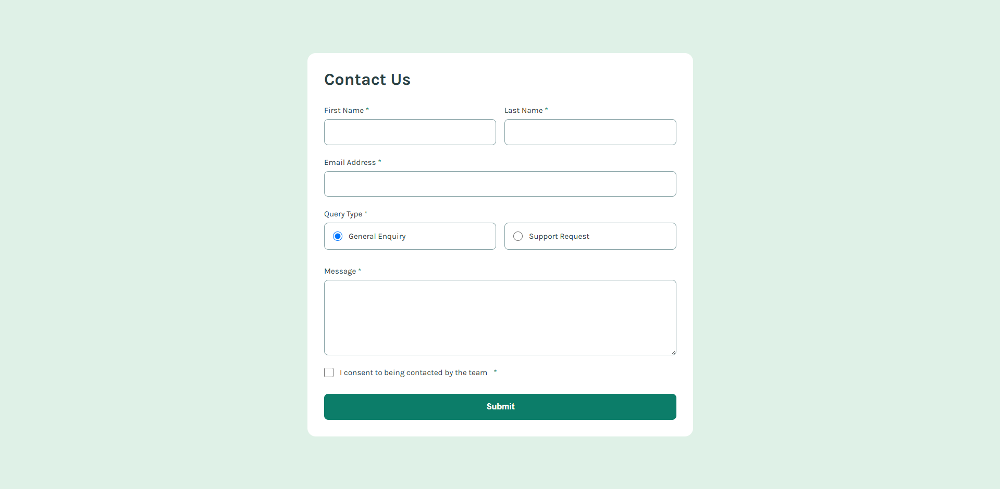

# Frontend Mentor - Contact form solution

This is a solution to the [Contact form challenge on Frontend Mentor](https://www.frontendmentor.io/challenges/contact-form--G-hYlqKJj). Frontend Mentor challenges help you improve your coding skills by building realistic projects. 

## Table of contents

- [Overview](#overview)
  - [The challenge](#the-challenge)
  - [Screenshot](#screenshot)
  - [Links](#links)
- [My process](#my-process)
  - [Built with](#built-with)
  - [What I learned](#what-i-learned)
  - [Continued development](#continued-development)
  - [Useful resources](#useful-resources)
  - [AI Collaboration](#ai-collaboration)
- [Author](#author)
- [Acknowledgments](#acknowledgments)

## Overview

### The challenge

Users should be able to:

- Complete the form and see a success toast message upon successful submission
- Receive form validation messages if:
  - A required field has been missed
  - The email address is not formatted correctly
- Complete the form only using their keyboard
- Have inputs, error messages, and the success message announced on their screen reader
- View the optimal layout for the interface depending on their device's screen size
- See hover and focus states for all interactive elements on the page

### Screenshot



### Links

- Solution URL: [solution](https://www.frontendmentor.io/solutions/contact-form-N2E-ZaGhJf)
- Live Site URL: [live site](https://xiburilouis-create.github.io/contact-form-main/)

## My process

### Built with

- Semantic HTML5 markup
- CSS custom properties
- Flexbox
- Mobile-first workflow

### What I learned


While working on this project, I learned how to create and style forms using HTML and CSS. I also improved my understanding of Flexbox, responsive layouts, and form elements such as input fields, radio buttons, checkboxes, and buttons. Additionally, I learned how to organize my code and apply CSS to match a design accurately

```css
body{
background:hsl(148,38%,91%);
display:flex;
justify-content:center;
align-items:center;
min-height:100vh;
padding:30px;
}
```

### Continued development

In future projects, I want to improve my CSS skills, especially with Flexbox, Grid, and responsive design. I also want to become more confident in creating layouts that match design mockups accurately and writing cleaner, more organized code.

### Useful resources

[Frontend Mentor](https://www.frontendmentor.io) – The challenge instructions and design files helped me understand the project requirements and improve my frontend development skills.

[MDN Web Docs](https://developer.mozilla.org) – I used MDN to learn more about HTML form elements, CSS properties, and responsive design. It is an excellent resource that I would recommend to anyone learning web development.

### AI Collaboration
I used ChatGPT as an AI assistant throughout the project. I used it to help generate HTML and CSS boilerplate code, troubleshoot layout issues, and explain why certain styles were not working. It also helped me understand Flexbox, form styling, and responsive design techniques. What worked well was the quick feedback and code suggestions, which made debugging much faster. One limitation was that I still needed to test and adjust some of the generated code to ensure it matched the project requirements and design exactly.

## Author

- Frontend Mentor - [@xiburilouis-create](https://www.frontendmentor.io/profile/xiburilouis-create)

## Acknowledgments


